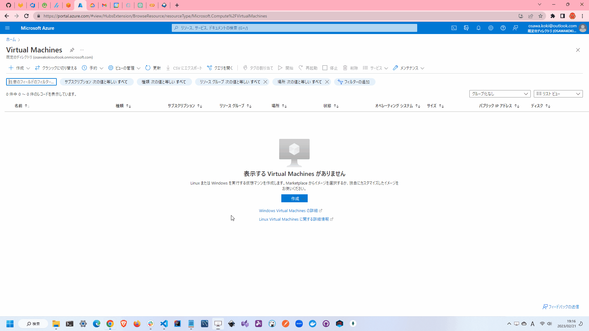

# simple-VM.tf

🦇🦇🦇 TerraformでAWS上にEC2を立ち上げるサンプルです。  

  

## 環境情報

| Name | Version |
| ---- | ---- |
| terraform | v1.3.7 |
| Azure CLI | 2.44.1 |

## 実行方法

`terraform.tfvars.example`をコピーして`terraform.tfvars`を作成し、適切な値を設定してください。  

```shell
terraform init
terraform plan
terraform apply
```

リソースを削除する場合は以下のコマンドを実行してください。  

```shell
terraform destroy
```

## その他イロイロ

ファイアウォールルールは以下の通りです。  

* インバウンド通信はSSH(22)・HTTP(80)・HTTPS(443)のみ許可
* SSHは自分のIPアドレスのみ許可
* アウトバウンド通信は全て許可

## 各種設定

### Terraform

[公式サイト](https://developer.hashicorp.com/terraform/downloads)にそって、Terraformをダウンロードしてください。  
インストール後は、以下のコマンドを実行して、Terraformのバージョンを確認してください。  

```shell
terraform version
```

正しくインストールされていない場合には、パスが通っていない可能性があります。  
パスが通っていない場合は、以下のコマンドを実行して、パスを通してください。  

```shell
# Windows
$env:PATH += ";C:/★パス★"

# Unix系
export PATH=$PATH:/★パス★
```

### Azure CLI

[公式サイト](https://learn.microsoft.com/ja-jp/cli/azure/install-azure-cli)にそって、Azure CLIをインストールしてください。  

インストール後は、以下のコマンドを実行して、Azureへログインしてください。  

```shell
az login
```
